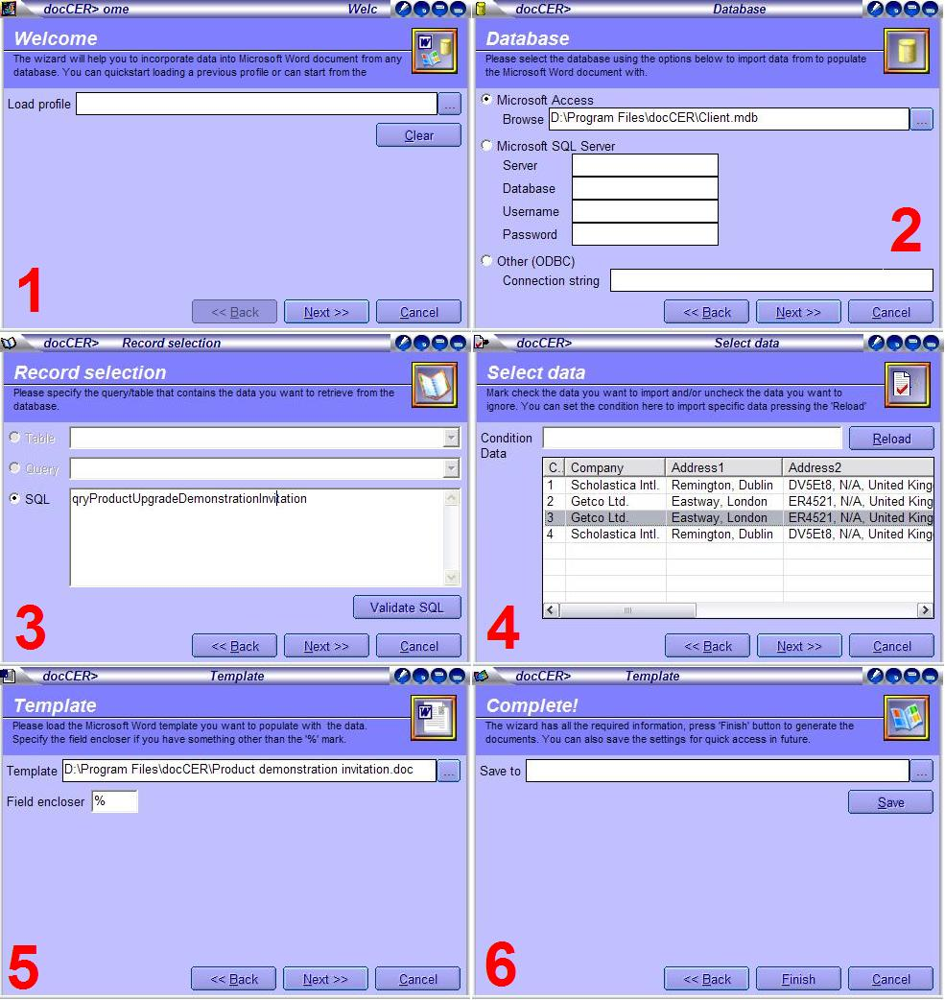



## docCER 1\.0&gt; Generate Word documents importing data from any database with templates \[UPDATE\]

### Description

This utility enables you to import data from any Access, MS SQL Sevrer or ODBC complaint data source and generate unlimited Word documents using templates. YOu can create templates of your own &amp; filter the you want. You can save the whole action as profiles for doing the same action over &amp; over by a few mouse clicks. Sample database &amp; usage is included. You need to have

MS Word installed on the system. You also may need to have MDAC 2.8 that can be found at

http://www.microsoft.com/downloads/details.aspx?FamilyID=6c05

0fe3-c795-4b7d-b037-185d0506396c&amp;DisplayLang=en, don't install it unless you face trouble. The only 3rd party ActiveX can be found at HTTP://www.GeoCities.Com/WOWFormer/

(note that the ActiveX is not the objective here!). I am grateful to Gongchuki for his Chameleon button. This will also show the beginners how to use ADO for any kind of

database in a modular way, creat &amp; use UserControls, clean &amp; structured programming. You may visit

http://www.ugibd.net/privatespace/joy/docCER.EXE for the ownloads.
 
### More Info
 

             |
---                |---
**Submitted On**   |2004-01-16 19:39:48
**By**             |[Broken Arrow](https://github.com/Planet-Source-Code/PSCIndex/blob/master/ByAuthor/broken-arrow.md)
**Level**          |Intermediate
**User Rating**    |4.4 (35 globes from 8 users)
**Compatibility**  |VB 6\.0
**Category**       |[Complete Applications](https://github.com/Planet-Source-Code/PSCIndex/blob/master/ByCategory/complete-applications__1-27.md)
**World**          |[Visual Basic](https://github.com/Planet-Source-Code/PSCIndex/blob/master/ByWorld/visual-basic.md)
**Archive File**   |[docCER\_1\_01695491172004\.zip](https://github.com/Planet-Source-Code/broken-arrow-doccer-1-0-gt-generate-word-documents-importing-data-from-any-database-with-t__1-51060/archive/master.zip)

